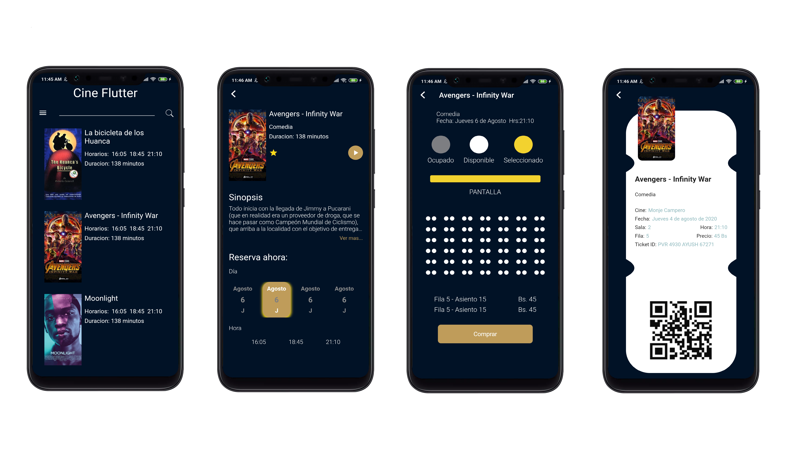

# Design Challenge #1

Reto de diseño #1 donde se implemento vistas en una aplicacion movil

## Informacion

El siguiente proyecto fue desarrollado en el primer "challenge" de la comunidad Flutter Devs Bolivia

Con la participacion de:

- [Ivan Sangueza (@ivansanguezax)](https://www.instagram.com/ivansanguezax)
- [Alvaro Martinez (@alvardud)](https://twitter.com/alvardud)

Puedes disfrutar el desarrollo de la sesion en:
[Design Challenge #1](https://www.facebook.com/FlutterDevsBolivia/videos/317782819591727)
[Adobe Xd project](https://xd.adobe.com/view/8b347e21-3a08-476b-44e1-2d68f3cf17e7-fd05/grid?fbclid=IwAR26i_1QE8j0A237UANSslvuW5xSFsb3fXbevUoXTAZh-Cu1i3VVbhBgYoM)

## Flutter Devs Bolivia

Flutter Devs Bolivia es una comunidad enfocada en el aprendizaje de la tecnologia "Flutter"

Canales de Comunicacion:

- [Facebook](https://www.facebook.com/FlutterDevsBolivia)
- [Meetup](https://www.meetup.com/Flutter-Devs-Bolivia/)
- [YouTube](https://www.youtube.com/channel/UC6c5aFQhcV0JgcBD2Wv4PYw)
